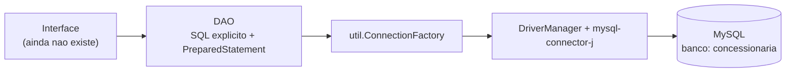

# ConcessionáriaBD

Sistema de banco de dados para uma **concessionária de veículos**, com backend em
**Java + MySQL e SQL explícito via JDBC** (sem ORM, sem framework).

Status atual: **backend completo e funcional** (models + DAOs). A interface visual
ainda não existe.

---

## 1. Contexto do projeto

O escopo do projeto é obter, **por meio de uma interface**, o seguinte:

| Requisito | Situação neste projeto |
|---|---|
| Inserir / excluir / alterar dados | ✅ `inserir` / `atualizar` / `excluir` nos **12 DAOs** |
| Alteração em pelo menos 2 tabelas | ✅ Todas as 12 tabelas têm `insert` / `update` / `delete` nos DAOs |
| Visualização dos dados | ✅ `listar()` em todos os DAOs e listagens com JOIN em 5 deles |
| Gráficos / estatísticas | ✅ Consultas de agregação prontas para gráficos de pizza e barras |
| Consultas com dificuldade | ✅ 10 consultas (C1–C10), várias com `JOIN`, `HAVING`, subconsulta e correlação |

O backend foi escrito para que **qualquer interface** apenas chame os métodos dos
DAOs: nenhuma classe de tela precisa conter SQL.



---

## 2. Estrutura de pastas

```
BDProj/
├── src/
│   ├── model/     12 Models (uma classe por tabela)
│   ├── dao/       12 DAOs (um por tabela — todo o SQL de CRUD fica aqui)
│   ├── util/      ConnectionFactory (unico ponto de conexao JDBC)
│   └── main/      Exec (teste rapido do backend)
├── lib/           mysql-connector-j-9.3.0.jar  (driver JDBC)
├── bin/           classes compiladas (gerado, ignorado pelo git)
├── .classpath     build path do Eclipse (JavaSE-19 + lib/mysql-connector-j-9.3.0.jar)
├── .project
├── .gitignore
└── README.md
```

---

## 3. Pré-requisitos

- **JDK 19 ou superior** (Temurin 21 é o que foi usado)
- **MySQL Server 8+** rodando em `localhost:3306`
- **Eclipse** (o projeto é um *Eclipse Project*, não é Maven/Gradle)
- Driver **MySQL Connector/J** já incluído em `lib/`

---

## 4. Preparando o banco (obrigatório antes de rodar)

1. Inicie o serviço do MySQL (`MySQLServer` no Windows: `services.msc`).
2. Execute, nesta ordem, os scripts da entrega:
   1. script de **criação** (cria o banco `concessionaria` e as 12 tabelas);
   2. script de **inserção** (popula os dados).
3. Confirme o nome do banco: `concessionaria`.

---

## 5. Configuração da conexão

Tudo o que importa para conectar está em **um único arquivo**:
`src/util/ConnectionFactory.java`.

```java
private static final String BANCO = "concessionaria";

private static final String URL = "jdbc:mysql://localhost:3306/" + BANCO
        + "?useSSL=false"
        + "&allowPublicKeyRetrieval=true"
        + "&serverTimezone=America/Sao_Paulo";

private static final String USER = "root";
private static final String PASS = "root";   // <-- altere para a sua senha
```

**Altere `USER` e `PASS`** conforme a sua instalação do MySQL. Se o banco estiver em
outra máquina ou porta, ajuste também a `URL`.

Parâmetros da URL (mantenha os três):

| Parâmetro | Para que serve |
|---|---|
| `useSSL=false` | evita erro de certificado em servidor local |
| `allowPublicKeyRetrieval=true` | necessário no MySQL 8+ (autenticação `caching_sha2_password`) |
| `serverTimezone=America/Sao_Paulo` | evita erro de timezone nas colunas `DATE` |

---

## 6. Como compilar e executar

### Pelo Eclipse (recomendado)

1. `File > Import > General > Existing Projects into Workspace` → selecione `BDProj`.
2. Confirme em `Project > Properties > Java Build Path` que:
   - a JRE é Java 19+;
   - existe a entrada `lib/mysql-connector-j-9.3.0.jar` em **Libraries**.
3. `F5` (Refresh) e `Project > Clean…` para forçar o rebuild.
4. Rode `src/main/Exec.java` com `Ctrl+F11` — ele insere um modelo de exemplo e
   lista modelos e marcas (veja a seção 7).

### Pelo terminal (PowerShell)

```powershell
cd d:\BDProj
New-Item -ItemType Directory -Force bin | Out-Null
javac -d bin -encoding UTF-8 (Get-ChildItem -Recurse -Filter *.java src).FullName
java -cp "bin;lib/mysql-connector-j-9.3.0.jar" main.Exec
```

> No Windows o separador do classpath é `;`. No Linux/Mac seria `:`.
> O `-encoding UTF-8` evita que o `javac` leia os fontes como Cp1252.

⚠️ O projeto **compila** mesmo sem o JAR — a falta do driver só aparece em execução,
com `No suitable driver found for jdbc:mysql://...`.

---

## 7. O que o `main` faz hoje

Sem interface visual, `src/main/Exec.java` funciona como um teste rápido do backend:
insere um modelo de exemplo e lista duas tabelas, tudo através dos DAOs.

```java
modeloDAO.inserir(new Modelo(0, "Corolla", 1));

System.out.println("Modelos cadastrados:");
List<Modelo> modelos = modeloDAO.listar();
modelos.forEach(m -> System.out.println(m.getId() + " - " + m.getNome()));

System.out.println("\nMarcas cadastradas:");
List<Marca> marcas = marcaDAO.listar();
marcas.forEach(m -> System.out.println(m.getId() + " - " + m.getNome()));
```

Saída esperada (o `stack trace` no fim significa que o banco ou as credenciais não
responderam):

```
Modelos cadastrados:
3 - Corolla

Marcas cadastradas:
1 - Toyota
2 - Volkswagen
```

Dois detalhes desse trecho:

- o `1` de `new Modelo(0, "Corolla", 1)` é o `marca_id` — a marca de `id = 1` precisa
  existir, senão o `INSERT` falha por chave estrangeira;
- o `0` é o `id`, que o `ModeloDAO` ignora (a coluna é `AUTO_INCREMENT`), então
  **cada execução insere um "Corolla" novo**.

Quando a interface visual existir, ela substitui esse `main` e chama os mesmos DAOs.

---

## 8. Conectando pelo DBeaver (cliente visual)

O DBeaver é só uma ferramenta para **olhar e manipular** o banco por fora do Java.
Ele não substitui o driver do projeto.

### 8.1 Criar a conexão

1. `Database > New Database Connection` (ou `Ctrl+Shift+N`).
2. Selecione **MySQL** → `Next`.
3. Na aba **Main**, preencha:

   | Campo | Valor |
   |---|---|
   | Server Host | `localhost` |
   | Port | `3306` |
   | Database | `concessionaria` |
   | Username | `root` |
   | Password | a mesma senha usada no `ConnectionFactory` |
   | Save password | marcado (opcional) |

4. Clique em **Test Connection**:
   - Se aparecer aviso de driver ausente, clique em **Download** (o DBeaver baixa o
     Connector/J automaticamente pelo Maven).
   - Para usar o JAR que já está no projeto: `Edit Driver Settings > Libraries >
     Add File…` → selecione `BDProj/lib/mysql-connector-j-9.3.0.jar` →
     **Find Class** (deve encontrar `com.mysql.cj.jdbc.Driver`).
5. `Finish`.

### 8.2 Propriedades do driver equivalentes ao Java

Na aba **Driver properties** (ou direto na JDBC URL), use os **mesmos** parâmetros do
`ConnectionFactory` — sem eles a conexão falha com os mesmos erros do Java:

```
allowPublicKeyRetrieval = true
useSSL                  = false
serverTimezone          = America/Sao_Paulo
```

JDBC URL para copiar e colar (aba *Main > URL*):

```
jdbc:mysql://localhost:3306/concessionaria?useSSL=false&allowPublicKeyRetrieval=true&serverTimezone=America/Sao_Paulo
```

### 8.3 O que fazer no DBeaver

| Objetivo | Como |
|---|---|
| Ver as tabelas | expanda a conexão → `Databases > concessionaria > Tables` |
| Ver os dados | duplo clique na tabela → aba **Data** |
| Escrever SQL | `SQL Editor > New SQL script` (atalho padrão `Ctrl+]`) |
| Executar 1 comando | `Ctrl+Enter` |
| Executar o script inteiro | `Alt+X` |
| Gerar um `SELECT` pronto | botão direito na tabela → `Generate SQL > SELECT` |
| Importar um script `.sql` | abra o arquivo e pressione `Alt+X` |

### 8.4 Problemas comuns

| Mensagem | Causa / solução |
|---|---|
| `Public Key Retrieval is not allowed` | falta `allowPublicKeyRetrieval=true` |
| `Access denied for user 'root'@'localhost'` | senha diferente da do `ConnectionFactory` |
| `Unknown database 'concessionaria'` | o script de criação não foi executado |
| `Communications link failure` | serviço do MySQL parado ou porta diferente de 3306 |
| `The server time zone value ... is unrecognized` | falta `serverTimezone=America/Sao_Paulo` |
| `No suitable driver found` (no Java) | o JAR não está no build path do Eclipse |

---