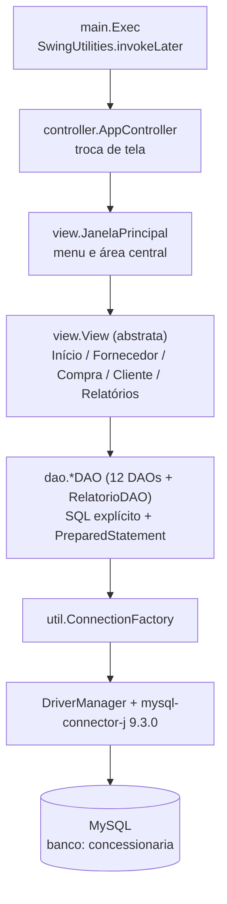

# ConcessionáriaBD

Sistema de banco de dados para uma **concessionária de veículos**, com interface
desktop em Java Swing sobre MySQL, usando SQL explícito via JDBC, sem ORM e sem
framework.

A primeira versão está funcional: existe uma janela com menu de navegação e telas que já
consultam e gravam no banco. Nem todas as 12 tabelas têm tela própria ainda, e o que
falta está listado na seção 3.

---

## 1. Contexto do projeto

O objetivo é cobrir, por meio de uma interface, os requisitos abaixo.

| Requisito | Como está atendido |
|---|---|
| Inserir, excluir e alterar dados | `inserir`, `atualizar` e `excluir` nos 12 DAOs, já usados pela interface em Clientes e Fornecedores |
| Alteração em pelo menos 2 tabelas | `cliente` e `endereco` na mesma tela, `compra` e `carro` na mesma transação, além de `fornecedor` |
| Visualização dos dados | `JTable` nas telas de Clientes, Fornecedores, histórico de Compras e nos 4 relatórios; `listarParaTabela()` com `JOIN` em 5 DAOs |
| Gráficos e estatísticas | 4 gráficos na tela de Relatórios: barras verticais, duas barras horizontais e uma pizza, alimentados pelas consultas agregadas |
| Consultas com dificuldade | 7 consultas em `sql/03_consultas.sql`, com `JOIN` encadeado, `GROUP BY` usando `COUNT`, `SUM`, `AVG`, `MIN` e `MAX`, subconsulta e `LEFT JOIN` |

A regra que o projeto segue é simples: o SQL fica nos DAOs. A tela não monta `INSERT`
nem `UPDATE`, apenas chama métodos como `clienteDAO.inserir(...)`. Há duas exceções
conhecidas. A `CompraView` abre transação própria para gravar `compra` e `carro` juntos,
e o `RelatorioDAO` devolve um `DefaultTableModel` já montado, o que faz o DAO de
relatórios conhecer o Swing.


```mermaid
flowchart TD
    EXEC["main.Exec<br/>SwingUtilities.invokeLater"]
    CTRL["controller.AppController<br/>troca de tela"]
    WIN["view.JanelaPrincipal<br/>menu e área central"]
    VIEW["view.View (abstrata)<br/>Início / Fornecedor / Compra / Cliente / Relatórios"]
    DAO["dao.*DAO (12 DAOs + RelatorioDAO)<br/>SQL explícito + PreparedStatement"]
    CF["util.ConnectionFactory"]
    DJ["DriverManager + mysql-connector-j 9.3.0"]
    DB[("MySQL<br/>banco: concessionaria")]

    EXEC --> CTRL --> WIN --> VIEW
    VIEW --> DAO --> CF --> DJ --> DB
```

---

## 2. Estrutura de pastas

Todo o código fica sob o pacote `br.cesar.bd.concessionaria`. Não existe
`module-info.java`, e isso é intencional: sem módulos, o carregamento do driver JDBC não
precisa de configuração extra.

```
BDProj/
├── sql/              01_criacao.sql, 02_insercao.sql e 03_consultas.sql
├── src/br/cesar/bd/concessionaria/
│   ├── main/         Exec: ponto de entrada que abre a janela
│   ├── controller/   AppController: cria a janela, instancia as views e troca de tela
│   ├── view/         View (abstrata), Rota, JanelaPrincipal e as 5 telas
│   ├── model/        12 Models, uma classe por tabela
│   ├── dao/          12 DAOs, um por tabela, mais o RelatorioDAO
│   └── util/         ConnectionFactory, único ponto de conexão JDBC
├── lib/              mysql-connector-j-9.3.0.jar, jfreechart-1.5.4.jar e jcommon-1.0.24.jar
├── bin/              classes compiladas (gerado e ignorado pelo git)
├── .vscode/          settings.json com sourcePaths e referencedLibraries (ignorado pelo git)
├── .classpath        build path do Eclipse (JavaSE-19 e os JARs de lib/)
├── .project
├── .gitignore
└── README.md
```

---

## 3. A interface (Swing)

O `Exec` faz uma coisa só: subir a aplicação na *Event Dispatch Thread*.

```java
SwingUtilities.invokeLater(() -> new AppController().iniciar());
```

O `AppController` cria a `JanelaPrincipal`, um `JFrame` de 800x600, e instancia uma única
vez cada tela do enum `Rota`, guardando todas num `EnumMap<Rota, View>`. Navegar é
chamar `navegar(Rota destino)`, que faz três coisas:

1. `view.aoAbrir()`: a tela recarrega os dados do banco;
2. `janela.updateMenu(destino)`: o botão da tela ativa fica destacado e desabilitado;
3. `janela.setBody(view)`: a tela entra no painel central.


```mermaid
sequenceDiagram
    participant U as Usuário
    participant J as JanelaPrincipal
    participant C as AppController
    participant V as ClienteView
    U->>J: clica em "Clientes"
    J->>C: navegar(Rota.CLIENTE)
    C->>V: aoAbrir()
    V->>V: listarParaTabela() -> JTable
    C->>J: updateMenu + setBody
```

### Telas

| Botão (rota) | Classe | O que faz hoje |
|---|---|---|
| Inicio | `InicioView` | tela vazia, reservada para o dashboard |
| Fornecedores | `FornecedorView` | CRUD de `fornecedor` (CNPJ, nome e e-mail) com `JTable`; clicar numa linha preenche o formulário e trava o CNPJ |
| Recibos de Compras | `CompraView` | monta um lote de compra: escolhe o fornecedor, adiciona carros (modelo, cor, ano, preço e chassi) numa lista e grava `compra` e `carro` numa única transação; o botão "Ver Recibos" abre o histórico com `JOIN` do fornecedor |
| Clientes | `ClienteView` | CRUD de `cliente` e `endereco` na mesma tela; a tabela vem de `listarParaTabela()`, com JOIN entre cliente e endereço, e ao excluir chama `excluirSeNaoUsado()` para não deixar endereço órfão |
| Relatorios | `RelatoriosView` | 4 consultas com `JOIN`, uma delas com subconsulta; cada botão carrega a tabela e o gráfico JFreeChart correspondente, com barras de compras por fornecedor, barras de estoque por marca e modelo, pizza de clientes por cidade e UF e barras das vendas acima da média |

`View` é a classe abstrata de que todas as telas herdam (`extends JPanel`). Ela obriga
cada tela a implementar `aoAbrir()` e oferece `mostrarMensagem(texto, erro)`, um
`JOptionPane` já configurado para sucesso ou erro. É por isso que nenhuma tela precisa
escrever no console.

### O que ainda não está ligado

- os botões `+` de nova cor e nova marca, assim como o "Salvar Novo Modelo" dentro da
  `CompraView`, ainda não gravam no banco: eles apenas fecham o diálogo e recarregam a
  lista;
- não existem telas para `venda`, `carro`, `vendedor`, `modelo`, `marca` e para as duas
  tabelas de telefone. Os DAOs dessas tabelas já estão prontos, faltam as views;
- a `InicioView` continua vazia, e é o lugar previsto para o dashboard.

---

## 4. Pré-requisitos

- JDK 19 ou superior (o `.classpath` aponta para JavaSE-19);
- MySQL Server 8 ou superior rodando em `localhost:3306`;
- VS Code com o *Extension Pack for Java*, ou Eclipse. O projeto é um Eclipse Project
  puro, não é Maven nem Gradle;
- driver MySQL Connector/J, já incluído em `lib/`;
- JFreeChart 1.5.4, também em `lib/`. Precisa ser da linha 1.5.x, porque o código usa
  `DefaultPieDataset<String>` com genéricos;
- Swing não exige nada, pois já vem no JDK.

---

## 5. Preparando o banco (obrigatório antes de abrir a janela)

Os scripts ficam em `sql/` e rodam nesta ordem.

| Arquivo | O que faz |
|---|---|
| `sql/01_criacao.sql` | derruba o banco se ele existir, cria `concessionaria` em utf8mb4 e as 12 tabelas |
| `sql/02_insercao.sql` | popula os dados: 50 carros (38 vendidos e 12 em estoque), 38 vendas em 6 meses e 30 clientes em 12 cidades |
| `sql/03_consultas.sql` | as 7 consultas analíticas, apenas leitura |

Pelo cliente `mysql`, redirecione o arquivo como entrada padrão, para os bytes passarem
intactos:

```powershell
$mysql = 'C:\Program Files\MySQL\MySQL Server 26.7\bin\mysql.exe'
Get-ChildItem sql\*.sql | Sort-Object Name | ForEach-Object {
    Start-Process $mysql -ArgumentList '-u','root','-proot','--default-character-set=utf8mb4' `
        -RedirectStandardInput $_.FullName -NoNewWindow -Wait
}
```

No DBeaver, abra cada arquivo e use `Alt+X`, na mesma ordem.

Depois confirme com `show tables;`, que deve listar 12 tabelas, e com
`select count(*) from carro;`, que deve devolver 50.

> Evite o pipe do PowerShell (`Get-Content ... | mysql.exe`). Ele reencoda o texto para a
> página de código do console, que em português do Brasil é CP850, e o acento acaba
> gravado como dois caracteres: `'Pérola'` vira `'P├®rola'` dentro do banco. Os scripts
> começam com `SET NAMES utf8mb4;` justamente para o servidor interpretar os bytes como
> UTF-8, mas o `Start-Process` acima e o `Alt+X` do DBeaver são os caminhos sem risco.
> Para conferir, rode `select HEX(nome) from cor where id = 24;` e veja se termina em
> `C3A9`.

---

## 6. Configuração da conexão

Tudo o que importa para conectar está em um único arquivo,
`src/br/cesar/bd/concessionaria/util/ConnectionFactory.java`.

```java
private static final String BANCO = "concessionaria";

private static final String URL = "jdbc:mysql://localhost:3306/" + BANCO
        + "?useSSL=false"
        + "&allowPublicKeyRetrieval=true"
        + "&serverTimezone=America/Sao_Paulo";

private static final String USER = "root";
private static final String PASS = "root";   // <-- altere para a sua senha
```

Altere `USER` e `PASS` conforme a instalação do MySQL da sua máquina. Se o banco estiver
em outra máquina ou em outra porta, ajuste também a `URL`.

Os três parâmetros da URL devem ser mantidos.

| Parâmetro | Para que serve |
|---|---|
| `useSSL=false` | evita erro de certificado em servidor local |
| `allowPublicKeyRetrieval=true` | necessário no MySQL 8+ (autenticação `caching_sha2_password`) |
| `serverTimezone=America/Sao_Paulo` | evita erro de timezone nas colunas `DATE` |

---

## 7. Como compilar e executar

### Pelo terminal (PowerShell)

```powershell
cd d:\BDProj
New-Item -ItemType Directory -Force bin | Out-Null
javac -cp "lib/*" -d bin -encoding UTF-8 (Get-ChildItem -Recurse -Filter *.java src).FullName
java -cp "bin;lib/*" br.cesar.bd.concessionaria.main.Exec
```

> No Windows o separador do classpath é `;`; no Linux e no macOS seria `:`.
> O `*` pega todos os JARs de `lib/` e é necessário nos dois comandos. Sem ele, o `javac`
> falha com `package org.jfree.chart does not exist`, e o `java` quebra ao abrir a tela
> de Relatórios, com `NoClassDefFoundError: org/jfree/chart/ChartFactory`.
> O `-encoding UTF-8` evita que o `javac` leia os fontes como Cp1252.
>
> Em `lib/` há três JARs, mas só dois são usados: o Connector/J e o JFreeChart 1.5.4. O
> `jcommon-1.0.24.jar` está lá porque o JFreeChart 1.0.x dependia dele; a linha 1.5 não
> usa. Vale saber também que, no VS Code, quem manda é o `.classpath`. A opção
> `java.project.referencedLibraries` do `.vscode/settings.json` não tem efeito neste
> projeto, porque ele é um Eclipse Project. Se alguém copiar um JAR novo para `lib/` e
> ele continuar sem resolver, é a entrada no `.classpath` que precisa ser criada.

### Pelo Eclipse (alternativa)

1. `File > Import > General > Existing Projects into Workspace` e selecione `BDProj`.
2. Em `Project > Properties > Java Build Path`, confirme que a JRE é Java 19 ou superior
   e que os JARs de `lib/` aparecem em Libraries. O `.classpath` versionado já traz os
   três: `mysql-connector-j-9.3.0.jar`, `jfreechart-1.5.4.jar` e `jcommon-1.0.24.jar`.
3. Pressione `F5` para atualizar e use `Project > Clean…` para forçar o rebuild.
4. Rode `src/br/cesar/bd/concessionaria/main/Exec.java` com `Ctrl+F11`.

---

## 8. Problemas comuns (Java e JDBC)

| Mensagem ou sintoma | Causa provável |
|---|---|
| `No suitable driver found for jdbc:mysql://...` | o `mysql-connector-j-9.3.0.jar` ficou fora do classpath; o projeto compila e só quebra ao rodar |
| `NoClassDefFoundError: org/jfree/chart/...` ao abrir uma tela | o `jfreechart-1.5.4.jar` ficou fora do classpath; confira o `lib/*` na seção 7 |
| `Access denied for user 'root'@'localhost' (using password: YES)` | a senha do `ConnectionFactory` é diferente da senha real do MySQL |
| `Unknown database 'concessionaria'` | o script de criação não foi executado (seção 5) |
| `Communications link failure` | serviço do MySQL parado, ou porta diferente de 3306 |
| `The server time zone value ... is unrecognized` | falta `serverTimezone=America/Sao_Paulo` na URL |
| `Cannot add or update a child row: a foreign key constraint fails` | tentativa de gravar o filho antes do pai, como carro sem compra ou cliente sem endereço |
| `Duplicate entry ... for key ...` | chave já existente, como CNPJ, CPF ou chassi repetido |
| A janela não abre | veja o terminal, porque um erro na *EDT* aparece no console mesmo quando a tela de erro não chega a aparecer |

---

## 9. Conectando pelo DBeaver (cliente visual)

O DBeaver é apenas uma ferramenta para olhar e manipular o banco por fora do Java, e não
substitui o driver do projeto.

### 9.1 Criar a conexão

1. `Database > New Database Connection` (ou `Ctrl+Shift+N`).
2. Selecione **MySQL** → `Next`.
3. Na aba **Main**, preencha:

   | Campo | Valor |
   |---|---|
   | Server Host | `localhost` |
   | Port | `3306` |
   | Database | `concessionaria` |
   | Username | `root` |
   | Password | a mesma senha usada no `ConnectionFactory` |
   | Save password | marcado (opcional) |

4. Clique em **Test Connection**:
   - Se aparecer aviso de driver ausente, clique em **Download** (o DBeaver baixa o
     Connector/J automaticamente pelo Maven).
   - Para usar o JAR que já está no projeto: `Edit Driver Settings > Libraries >
     Add File…` → selecione `BDProj/lib/mysql-connector-j-9.3.0.jar` →
     **Find Class** (deve encontrar `com.mysql.cj.jdbc.Driver`).
5. `Finish`.

### 9.2 Propriedades do driver equivalentes ao Java

Na aba **Driver properties**, ou direto na JDBC URL, repita os mesmos parâmetros do
`ConnectionFactory`. Sem eles a conexão falha com os mesmos erros do Java.

```
allowPublicKeyRetrieval = true
useSSL                  = false
serverTimezone          = America/Sao_Paulo
```

JDBC URL para copiar e colar (aba *Main > URL*):

```
jdbc:mysql://localhost:3306/concessionaria?useSSL=false&allowPublicKeyRetrieval=true&serverTimezone=America/Sao_Paulo
```

### 9.3 O que fazer no DBeaver

| Objetivo | Como |
|---|---|
| Ver as tabelas | expanda a conexão → `Databases > concessionaria > Tables` |
| Ver os dados | duplo clique na tabela → aba **Data** |
| Escrever SQL | `SQL Editor > New SQL script` (atalho padrão `Ctrl+]`) |
| Executar 1 comando | `Ctrl+Enter` |
| Executar o script inteiro | `Alt+X` |
| Gerar um `SELECT` pronto | botão direito na tabela → `Generate SQL > SELECT` |
| Importar um script `.sql` | abra o arquivo e pressione `Alt+X` |

### 9.4 Problemas comuns (DBeaver)

| Mensagem | Causa / solução |
|---|---|
| `Public Key Retrieval is not allowed` | falta `allowPublicKeyRetrieval=true` |
| `Access denied for user 'root'@'localhost'` | senha diferente da do `ConnectionFactory` |
| `Unknown database 'concessionaria'` | o script de criação não foi executado |
| `Communications link failure` | serviço do MySQL parado ou porta diferente de 3306 |
| `The server time zone value ... is unrecognized` | falta `serverTimezone=America/Sao_Paulo` |
| `No suitable driver found` (no Java) | o JAR não está no classpath (seção 7) |

---