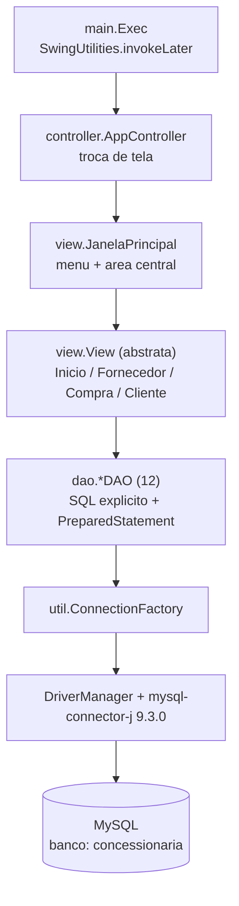
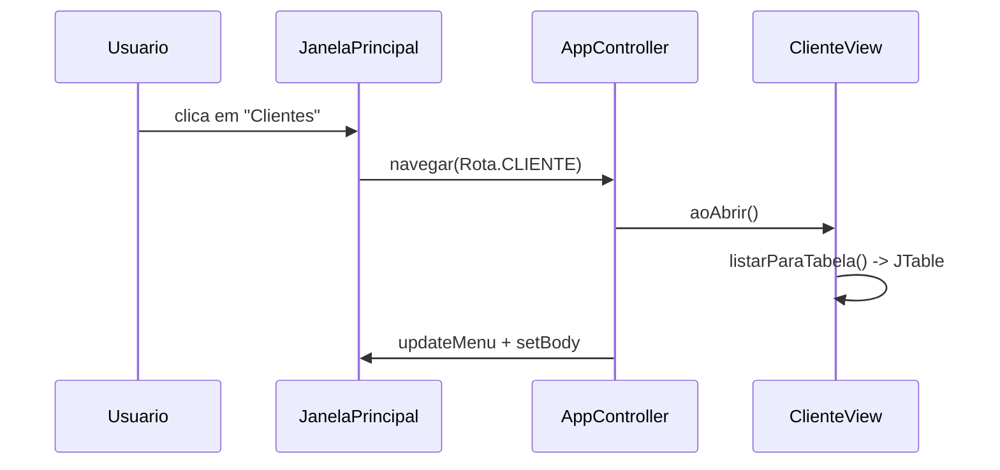

# ConcessionáriaBD

Sistema de banco de dados para uma **concessionária de veículos**, com **interface
desktop em Java Swing** e **MySQL com SQL explícito via JDBC** (sem ORM, sem framework).

Status atual: **interface funcional** — janela única com menu de navegação e telas que
já leem e gravam no banco. Ainda não existem telas para todas as 12 tabelas (veja a
seção 3).

---

## 1. Contexto do projeto

O escopo do projeto é obter, **por meio de uma interface**, o seguinte:

| Requisito | Situação neste projeto |
|---|---|
| Inserir / excluir / alterar dados | ✅ `inserir` / `atualizar` / `excluir` nos **12 DAOs**, já ligados na interface em **Clientes** e **Fornecedores** |
| Alteração em pelo menos 2 tabelas | ✅ `cliente` + `endereco` (mesma tela, mesma operação), `compra` + `carro` (mesma transação) e `fornecedor` |
| Visualização dos dados | ✅ `JTable` nas telas de Clientes, Fornecedores e no histórico de Compras; `listarParaTabela()` com `JOIN` em 5 DAOs |
| Gráficos / estatísticas | ❌ ainda não implementado — não existe nenhuma consulta de agregação no código |
| Consultas com dificuldade | ⚠️ existem 5 listagens com `JOIN`; o SQL das consultas ainda precisa ser entregue em arquivo próprio |

A regra do projeto é: **o SQL mora nos DAOs**. A tela não monta `INSERT`/`UPDATE` — ela
chama métodos como `clienteDAO.inserir(...)`. (Única exceção hoje: `CompraView`, que
abre uma transação própria para gravar `compra` + `carro` de uma vez.)


```mermaid
flowchart TD
    EXEC["main.Exec<br/>SwingUtilities.invokeLater"]
    CTRL["controller.AppController<br/>troca de tela"]
    WIN["view.JanelaPrincipal<br/>menu + area central"]
    VIEW["view.View (abstrata)<br/>Inicio / Fornecedor / Compra / Cliente"]
    DAO["dao.*DAO (12)<br/>SQL explicito + PreparedStatement"]
    CF["util.ConnectionFactory"]
    DJ["DriverManager + mysql-connector-j 9.3.0"]
    DB[("MySQL<br/>banco: concessionaria")]

    EXEC --> CTRL --> WIN --> VIEW
    VIEW --> DAO --> CF --> DJ --> DB
```

---

## 2. Estrutura de pastas

Pacote-base: `br.cesar.bd.concessionaria`. Não há `module-info.java` — de propósito,
para não complicar o carregamento do driver JDBC.

```
BDProj/
├── src/br/cesar/bd/concessionaria/
│   ├── main/         Exec — ponto de entrada; abre a janela
│   ├── controller/   AppController — cria a janela, instancia as views, troca de tela
│   ├── view/         View (abstrata), Rota, JanelaPrincipal e as telas
│   ├── model/        12 Models (uma classe por tabela)
│   ├── dao/          12 DAOs (um por tabela — todo o SQL fica aqui)
│   └── util/         ConnectionFactory (unico ponto de conexao JDBC)
├── lib/              mysql-connector-j-9.3.0.jar  (driver JDBC)
├── bin/              classes compiladas (gerado, ignorado pelo git)
├── .vscode/          settings.json com sourcePaths + referencedLibraries (ignorado pelo git)
├── .classpath        build path do Eclipse (JavaSE-19 + lib/mysql-connector-j-9.3.0.jar)
├── .project
├── .gitignore
└── README.md
```

---

## 3. A interface (Swing)

O `Exec` faz uma coisa só: subir a aplicação na *Event Dispatch Thread*.

```java
SwingUtilities.invokeLater(() -> new AppController().iniciar());
```

O `AppController` cria a `JanelaPrincipal` (um `JFrame` 800x600), instancia **uma única
vez** cada tela listada no enum `Rota` e guarda tudo num `EnumMap<Rota, View>`. Navegar
é chamar `navegar(Rota destino)`:

1. `view.aoAbrir()` — a tela recarrega os dados do banco;
2. `janela.updateMenu(destino)` — o botão da tela ativa fica destacado e desabilitado;
3. `janela.setBody(view)` — a tela entra no painel central.


```mermaid
sequenceDiagram
    participant U as Usuario
    participant J as JanelaPrincipal
    participant C as AppController
    participant V as ClienteView
    U->>J: clica em "Clientes"
    J->>C: navegar(Rota.CLIENTE)
    C->>V: aoAbrir()
    V->>V: listarParaTabela() -> JTable
    C->>J: updateMenu + setBody
```

### Telas

| Botão (rota) | Classe | O que faz hoje |
|---|---|---|
| **Inicio** | `InicioView` | tela vazia, reservada para o dashboard |
| **Fornecedores** | `FornecedorView` | CRUD de `fornecedor` (CNPJ, nome, e-mail) com `JTable`; clicar numa linha preenche o formulário e trava o CNPJ |
| **Recibos de Compras** | `CompraView` | monta um lote de compra: escolhe o fornecedor, adiciona carros (modelo, cor, ano, preço, chassi) numa lista e grava `compra` + `carro` **numa única transação**; o botão *Ver Recibos* abre o histórico com `JOIN` do fornecedor |
| **Clientes** | `ClienteView` | CRUD de `cliente` **e** `endereco` na mesma tela; a tabela vem de `listarParaTabela()` (JOIN cliente × endereço) e, ao excluir, chama `excluirSeNaoUsado()` para não deixar endereço órfão |

`View` é a classe-mãe (abstrata, `extends JPanel`). Ela obriga cada tela a implementar
`aoAbrir()` e entrega `mostrarMensagem(texto, erro)`, que é um `JOptionPane` já
configurado como sucesso/erro — por isso nenhuma tela precisa de `System.out`.

### O que ainda não está ligado

- os botões `+` de **nova cor** e **nova marca** e o *Salvar Novo Modelo* (dentro da
  `CompraView`) ainda **não gravam** no banco: só fecham o diálogo e recarregam a lista;
- não existem telas para `venda`, `carro`, `vendedor`, `modelo`, `marca` e as tabelas de
  telefone — os DAOs dessas tabelas já estão prontos, faltam as views;
- nenhuma consulta de agregação, logo ainda sem gráficos/estatísticas.

---

## 4. Pré-requisitos

- **JDK 19 ou superior** (o `.classpath` aponta para JavaSE-19)
- **MySQL Server 8+** rodando em `localhost:3306`
- **VS Code** (com o *Extension Pack for Java*) ou **Eclipse** — o projeto é um
  *Eclipse Project* puro, não é Maven/Gradle
- Driver **MySQL Connector/J** já incluído em `lib/`
- **Swing** já vem no JDK: nenhuma dependência extra para a interface

---

## 5. Preparando o banco (obrigatório antes de abrir a janela)

1. Inicie o serviço do MySQL (`MySQLServer` no Windows: `services.msc`).
2. Execute, nesta ordem, os scripts da entrega (no cliente `mysql` use
   `source C:/caminho/script.sql`; no DBeaver, abra o arquivo e use `Alt+X`):
   1. script de **criação** (cria o banco `concessionaria` e as 12 tabelas);
   2. script de **inserção** (popula os dados).
3. Confirme com `show tables;` — têm que aparecer **12 tabelas**.

> Se a criação parar em `compra`/`venda` com `ERROR 1064`, o script está usando
> `data DATE DEFAULT CURRENT_DATE`. A partir do MySQL 8.0.13 o valor padrão de data
> precisa de parênteses: `DEFAULT (CURRENT_DATE)`. A tabela `carro` falha em cascata
> (`ERROR 1824: Failed to open the referenced table 'compra'`) só porque depende dela.

---

## 6. Configuração da conexão

Tudo o que importa para conectar está em **um único arquivo**:
`src/br/cesar/bd/concessionaria/util/ConnectionFactory.java`.

```java
private static final String BANCO = "concessionaria";

private static final String URL = "jdbc:mysql://localhost:3306/" + BANCO
        + "?useSSL=false"
        + "&allowPublicKeyRetrieval=true"
        + "&serverTimezone=America/Sao_Paulo";

private static final String USER = "root";
private static final String PASS = "root";   // <-- altere para a sua senha
```

**Altere `USER` e `PASS`** conforme a sua instalação do MySQL. Se o banco estiver em
outra máquina ou porta, ajuste também a `URL`.

Parâmetros da URL (mantenha os três):

| Parâmetro | Para que serve |
|---|---|
| `useSSL=false` | evita erro de certificado em servidor local |
| `allowPublicKeyRetrieval=true` | necessário no MySQL 8+ (autenticação `caching_sha2_password`) |
| `serverTimezone=America/Sao_Paulo` | evita erro de timezone nas colunas `DATE` |

---

## 7. Como compilar e executar

### Pelo VS Code

O `.vscode/settings.json` do projeto já aponta o código-fonte e o driver, então não
precisa configurar build path na mão:

```json
"java.project.sourcePaths": ["src"],
"java.project.referencedLibraries": ["lib/**/*.jar"]
```

Abra `src/br/cesar/bd/concessionaria/main/Exec.java` e rode (botão ▶ no `main` ou
`Ctrl+F5`). Deve abrir a janela **Gestão de Concessionária**.

### Pelo terminal (PowerShell)

```powershell
cd d:\BDProj
New-Item -ItemType Directory -Force bin | Out-Null
javac -d bin -encoding UTF-8 (Get-ChildItem -Recurse -Filter *.java src).FullName
java -cp "bin;lib/mysql-connector-j-9.3.0.jar" br.cesar.bd.concessionaria.main.Exec
```

> No Windows o separador do classpath é `;`. No Linux/Mac seria `:`.
> O `-encoding UTF-8` evita que o `javac` leia os fontes como Cp1252.
> Sem o JAR no classpath o projeto **compila** normalmente, mas quebra ao rodar com
> `No suitable driver found for jdbc:mysql://...`.

### Pelo Eclipse (alternativa)

1. `File > Import > General > Existing Projects into Workspace` → selecione `BDProj`.
2. Confirme em `Project > Properties > Java Build Path` que a JRE é Java 19+ e que
   existe a entrada `lib/mysql-connector-j-9.3.0.jar` em **Libraries**.
3. `F5` (Refresh) e `Project > Clean…` para forçar o rebuild.
4. Rode `src/br/cesar/bd/concessionaria/main/Exec.java` com `Ctrl+F11`.

---

## 8. Problemas comuns (Java/JDBC)

| Mensagem / sintoma | Causa provável |
|---|---|
| `No suitable driver found for jdbc:mysql://...` | o `mysql-connector-j-9.3.0.jar` ficou fora do classpath (compila e quebra só ao rodar) |
| `Access denied for user 'root'@'localhost' (using password: YES)` | a senha do `ConnectionFactory` é diferente da senha real do MySQL |
| `Unknown database 'concessionaria'` | o script de criação não foi executado (seção 5) |
| `Communications link failure` | serviço do MySQL parado ou porta diferente de 3306 |
| `The server time zone value ... is unrecognized` | falta `serverTimezone=America/Sao_Paulo` na URL |
| `Cannot add or update a child row: a foreign key constraint fails` | tentar gravar o filho antes do pai (ex.: carro sem compra, cliente sem endereço) |
| `Duplicate entry ... for key ...` | chave já existente: CNPJ, CPF ou chassi repetido |
| A janela não abre | veja o terminal: erro na *EDT* aparece no console, mesmo quando a tela de erro não chega a aparecer |

---

## 9. Conectando pelo DBeaver (cliente visual)

O DBeaver é só uma ferramenta para **olhar e manipular** o banco por fora do Java.
Ele não substitui o driver do projeto.

### 9.1 Criar a conexão

1. `Database > New Database Connection` (ou `Ctrl+Shift+N`).
2. Selecione **MySQL** → `Next`.
3. Na aba **Main**, preencha:

   | Campo | Valor |
   |---|---|
   | Server Host | `localhost` |
   | Port | `3306` |
   | Database | `concessionaria` |
   | Username | `root` |
   | Password | a mesma senha usada no `ConnectionFactory` |
   | Save password | marcado (opcional) |

4. Clique em **Test Connection**:
   - Se aparecer aviso de driver ausente, clique em **Download** (o DBeaver baixa o
     Connector/J automaticamente pelo Maven).
   - Para usar o JAR que já está no projeto: `Edit Driver Settings > Libraries >
     Add File…` → selecione `BDProj/lib/mysql-connector-j-9.3.0.jar` →
     **Find Class** (deve encontrar `com.mysql.cj.jdbc.Driver`).
5. `Finish`.

### 9.2 Propriedades do driver equivalentes ao Java

Na aba **Driver properties** (ou direto na JDBC URL), use os **mesmos** parâmetros do
`ConnectionFactory` — sem eles a conexão falha com os mesmos erros do Java:

```
allowPublicKeyRetrieval = true
useSSL                  = false
serverTimezone          = America/Sao_Paulo
```

JDBC URL para copiar e colar (aba *Main > URL*):

```
jdbc:mysql://localhost:3306/concessionaria?useSSL=false&allowPublicKeyRetrieval=true&serverTimezone=America/Sao_Paulo
```

### 9.3 O que fazer no DBeaver

| Objetivo | Como |
|---|---|
| Ver as tabelas | expanda a conexão → `Databases > concessionaria > Tables` |
| Ver os dados | duplo clique na tabela → aba **Data** |
| Escrever SQL | `SQL Editor > New SQL script` (atalho padrão `Ctrl+]`) |
| Executar 1 comando | `Ctrl+Enter` |
| Executar o script inteiro | `Alt+X` |
| Gerar um `SELECT` pronto | botão direito na tabela → `Generate SQL > SELECT` |
| Importar um script `.sql` | abra o arquivo e pressione `Alt+X` |

### 9.4 Problemas comuns (DBeaver)

| Mensagem | Causa / solução |
|---|---|
| `Public Key Retrieval is not allowed` | falta `allowPublicKeyRetrieval=true` |
| `Access denied for user 'root'@'localhost'` | senha diferente da do `ConnectionFactory` |
| `Unknown database 'concessionaria'` | o script de criação não foi executado |
| `Communications link failure` | serviço do MySQL parado ou porta diferente de 3306 |
| `The server time zone value ... is unrecognized` | falta `serverTimezone=America/Sao_Paulo` |
| `No suitable driver found` (no Java) | o JAR não está no classpath/`referencedLibraries` (seção 7) |

---